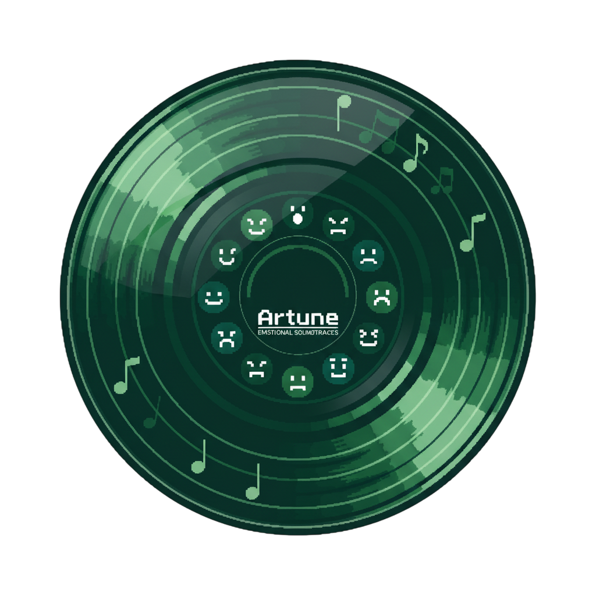
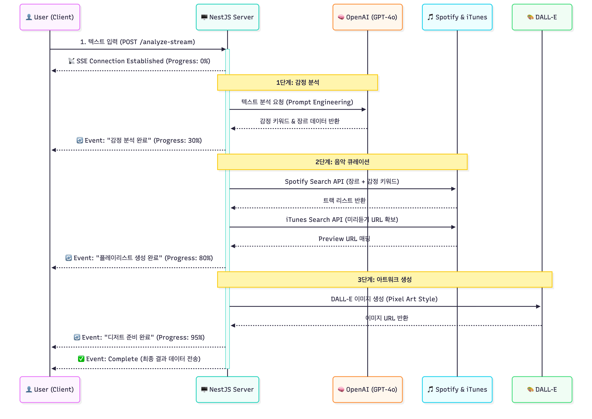

<div align="center">
  
  <h3>감정에 따른 음원 추천 서비스</h3>
  <p>
    당신의 하루, 당신의 감정을 텍스트로 들려주세요.<br/>
    <strong>AI(OPENAI)</strong>가 분석한 감정에 맞춰 <strong>음악(Spotify + Apple Music)</strong>과 <strong>디저트 아트워크(DALL-E)</strong>를 선물합니다.
  </p>

  <br/>

  <p>
    
    
    
    
    
  </p>
</div>

## 들어가기에 앞서

오픈미션을 시작을 앞두고 어떤 프로젝트를 진행해야할지 고민을 많이 했습니다. 결론적으로, 개발 입문 초창기 기획부터 관리까지 미흡했던 프로젝트를 새로 생성해서 배포까지 해보는 것을 목표로 잡았습니다. 또한, 예시로 보여주셨던 생소한 언어를 사용하는 주제와 기존에 사용했던 언어를 더 깊게 파고드는 예시 두 가지를 합친 형태의 주제를 가지고 진행하면 좋을 것 같았습니다.

### 🏃🏻 생소하지만 도전했는 것들

- nest.js (backend)
- framer-motion
- turbo-repo
- vitest
- API (spotify API, Itunes Search API, DALLE API)
- Vercel + Railway (Deployement)

### 🪏 기존에 사용했지만 더 깊게 파고든 부분

- Javascript
- CSS-in-JS (Emotion.js)
- React.js (Custom Hook)
- Zustand

### 💡 직면한 위기와 해결했던 방법들

<details>
<summary><strong>1. Spotify API 404: 추천 API 중단 사태와 우회 전략</strong></summary>
<br/>

- **위기**: 감정 분석 결과를 바탕으로 `Recommendations API`를 호출했으나, Spotify의 정책 변경(신규 앱 접근 제한)으로 인해 `404 Not Found` 에러가 발생하여 핵심 기능 구현이 불가능해짐.
- **해결**: `Search API`를 활용한 추천 시스템으로 설계를 변경.
  - `valence`(긍정도), `energy` 수치를 "happy", "chill", "sad" 등의 **감정 키워드**로 변환하는 함수 구현.
  - 장르와 감정 키워드를 조합한 검색 쿼리(예: `q: "pop happy"`)를 전송하여 추천 로직을 성공적으로 우회 구현함.

<br/>
</details>

<details>
<summary><strong>2. iTunes API: K-POP 검색 정확도와 Rate Limit 해결</strong></summary>
<br/>

- **위기**: Spotify의 미리듣기 URL 제공 중단으로 iTunes API를 도입했으나, 한/영 표기 문제("IU" vs "아이유")로 검색 정확도가 떨어지고, 과도한 요청으로 `403 Forbidden` 발생.
- **해결**: 복잡한 문자열 유사도 검사 대신 **단순한 국가별 순차 검색(Waterfall)** 전략 채택.
  - **순차 검색**: 한국(`kr`) → 일본(`jp`) → 미국(`us`) 스토어를 순서대로 조회하여 K-POP과 팝송 모두의 검색 적중률을 높임.
  - **Rate Limit 방어**: 배치 처리 시 요청 간 `100ms` 딜레이를 주어 안정적인 데이터 수집 확보.

</details>

<details>
<summary><strong>3. 좀비 오디오(Zombie Audio): 브라우저 탭 생명주기 관리</strong></summary>
<br/>

- **위기**: 사용자가 음악을 듣던 중 다른 탭으로 이동하거나 화면을 꺼도 오디오가 계속 재생되는 현상 발생. 단순 `useEffect` 클린업으로는 탭 전환(Visibility Change)을 감지하지 못함.
- **해결**: 리액트 컴포넌트를 넘어 **브라우저 탭의 생명주기**까지 관리 범위 확장.
  - `visibilitychange` 이벤트 리스너를 도입하여, 탭이 백그라운드로 전환되면 즉시 `stopAndReset` 함수를 호출해 오디오를 강제 종료.
  - 오디오 로딩 직후(`onCanPlay`)에도 현재 탭 활성화 여부를 체크하는 방어 로직 추가.

<br/>
</details>

### 💭 아쉬웠던 점

<details>
<summary><strong>1. 추천의 다양성 vs 인기도의 딜레마</strong></summary>
<br/>

- **문제 상황**: 초기에는 단순히 장르와 감정 수치만으로 곡을 추천했으나, 커버 곡이나 노래방 반주 등 저품질 데이터가 섞이는 문제가 있었습니다. 이를 해결하기 위해 `popularity`(인기도)를 정렬의 최우선 순위로 두었습니다.
- **한계점**: 품질은 확보되었으나, 매번 BTS, 아이유 등 최상위권 인기 아티스트의 곡만 반복적으로 추천되는 현상이 발생했습니다. 코드 레벨에서 `ensureArtistDiversity` 함수를 구현하여 **"동일 아티스트 곡은 최대 2곡까지만 허용"**하도록 제한을 두었음에도, 워낙 모집단의 상위권이 고정적이다 보니 사용자가 느끼는 '새로운 음악을 발견하는 즐거움(Digging)'은 다소 부족했습니다.
- **배운 점**: 추천 시스템에서 '신뢰도(인기도)'와 '참신함(다양성)' 사이의 균형을 맞추는 것이 가장 어려운 과제임을 깨달았습니다.

<br/>
</details>

<details>
<summary><strong>2. DALL-E 비용 이슈와 정적 이미지 대체</strong></summary>
<br/>

- **시도했던 과정**: 초기 개발 단계에서는 **DALL-E 3** 모델을 연동하여, 감정 키워드와 장르를 프롬프트로 조합해 매번 세상에 하나뿐인 고퀄리티 픽셀 아트를 생성했습니다. 결과물은 훌륭했지만, 테스트 며칠 만에 API 비용이 2만 원을 초과하는 문제가 발생했습니다. 비용 절감을 위해 **DALL-E 2**로 다운그레이드했으나, 여전히 학생 개발자로서 지속적으로 운영하기에는 부담스러운 비용이었습니다.
- **최종 결정**: 결국 API 연동을 해제하고, 미리 생성해둔 감정별 고퀄리티 정적 이미지를 매핑하여 제공하는 현실적인 타협안을 선택했습니다.
- **회고**: 기술적인 구현보다 **비용 효율성(Cost Efficiency)과 서비스의 지속 가능성**을 고려하는 것이 실제 서비스 운영에 있어 얼마나 중요한지 뼈저리게 느꼈습니다.

<br/>
</details>

<details>
<summary><strong>3. JS 환경에서의 NestJS 데코레이터 한계</strong></summary>
<br/>

- **기술적 제약**: 우아한테크코스 프리코스 과정을 통해 Class 기반 객체지향 개발에 익숙해져 있어 NestJS를 선택했으나, TypeScript가 아닌 **JavaScript(Babel)** 환경에서 구축하다 보니 예상치 못한 난관에 부딪혔습니다. 특히 NestJS의 핵심인 `@Body()`, `@Query()` 같은 파라미터 데코레이터가 JS 환경에서는 기본적으로 지원되지 않았습니다.
- **해결과 아쉬움**: `createParamDecorator`를 활용해 커스텀 데코레이터를 직접 구현하여 문제를 해결했지만, 프레임워크가 제공하는 강력한 타입 안정성과 생산성을 100% 활용하지 못했다는 아쉬움이 남았습니다. 프레임워크의 설계 철학에 맞는 언어(TypeScript)를 선택하는 것이 중요함을 배웠습니다.

</details>

### 🔭 향후 계획

<details>
<summary><strong>1. 추천 알고리즘 고도화 (Serendipity)</strong></summary>
<br/>

- **알고리즘 개선**: 현재의 '인기도' 절대 의존 방식에서 벗어나, **가중치 기반 랭킹 시스템**을 도입할 예정입니다.
  - `Recency`: 발매일이 최신인 곡에 가중치 부여
  - `Diversity`: 장르의 희소성에 가중치 부여
- **목표**: 이를 통해 사용자가 이미 알고 있는 노래뿐만 아니라, 자신의 취향에 딱 맞지만 미처 몰랐던 **'숨겨진 명곡'을 발견하는 경험(Serendipity)** 을 제공하고자 합니다.

<br/>
</details>

<details>
<summary><strong>2. Web Audio API 기반 UX 개선</strong></summary>
<br/>

- **오디오 효과 고도화**: 현재는 오디오 종료 시 `Volume Fade-out`만 적용되어 있습니다. 차기 업데이트에서는 `Web Audio API`를 심도 있게 다루어, 멈출 때 발생하는 **Pitch Down(음정 낮춤) 효과**를 자연스럽게 구현해 아날로그 감성을 극대화할 계획입니다.
- **시각화**: `AnalyserNode`를 활용하여 음악의 주파수에 따라 반응하는 **오디오 비주얼라이저(Visualizer)**를 모달이나 배경에 적용해 시청각적인 즐거움을 더할 예정입니다.

<br/>
</details>

<details>
<summary><strong>3. TypeScript 마이그레이션</strong></summary>
<br/>

- **전환 계획**: 이번 프로젝트에서 겪은 JS 환경의 한계(데코레이터 이슈, 컴파일 타임 에러 감지 불가 등)를 해결하기 위해, 백엔드와 프론트엔드 코드베이스를 점진적으로 **TypeScript**로 전환할 것입니다.
- **기대 효과**: 이를 통해 데이터 모델(DTO) 간의 정합성을 보장하고, 자동 완성 및 타입 추론을 통해 개발 생산성과 유지보수성을 대폭 향상시킬 수 있을 것으로 기대합니다.

</details>

## 📖 프로젝트 소개

**Artune**은 사용자가 입력한 일기나 짧은 텍스트를 분석하여, 현재 감정 상태에 가장 적합한 음악 플레이리스트와 시각적 즐거움을 주는 픽셀 아트 디저트를 제공하는 웹 서비스입니다.

단순 음악 추천이 아닌 감정을 **더 깊이 느끼고 싶을 때(Immerse)** 와 **전환하고 싶을 때(Soothe)** 두 가지 선택지를 제공합니다.

### 🌟 핵심 기능

- **AI 감정 분석 & 큐레이션**: OpenAI GPT 4.1 mini 모델을 활용해 텍스트의 미묘한 감정선을 분석하고, Spotify API 파라미터(Valence, Energy, Tempo)로 변환합니다.
- **Dual Mode Playlist**:
  - 🎶 **감정 심취 (Immerse)**: 슬플 땐 더 슬픈 음악으로, 기쁠 땐 더 신나는 음악으로 감정을 극대화합니다.
  - 🌿 **감정 완화 (Soothe)**: 격한 감정을 차분하게, 혹은 우울한 기분을 산뜻하게 전환합니다.
- **인터랙티브 음악 청취**:
  - Spotify 메타데이터와 **iTunes Search API**를 결합하여 **30초 미리듣기**를 제공합니다.
  - **CD 바이닐 인터랙션**: 음악 재생 시 CD가 플레이어에 들어가고, 정지 시 **DJ 스크래치 효과(Fade-out & Pitch down)**와 함께 멈추는 디테일한 UX를 구현했습니다.
- **감정 맞춤 Pixel Art**: 감정 키워드와 장르를 조합하여 DALL-E 프롬프트를 생성, 매번 다른 '오늘의 디저트' 픽셀 아트를 제공합니다. (해당 기능은 잠시 정지시켰습니다.)
- **실시간 분석 경험**: Server-Sent Events (SSE)를 도입하여 감정 분석 → 음악 탐색 → 이미지 생성의 진행 상황을 실시간 프로그레스 바로 시각화했습니다.

### 🏗️ 시스템 아키텍처 (System Architecture)

사용자의 텍스트가 어떻게 음악과 이미지로 변환되는지 보여주는 데이터 흐름도입니다.  
**Server-Sent Events (SSE)** 를 도입하여, 각 단계가 완료될 때마다 클라이언트에게 실시간으로 피드백을 제공합니다.

<p align="center">
  
</p>

## 🛠 기술 스택 (Tech Stack)

### Architecture

- **Monorepo**: Turborepo (Frontend/Backend 패키지 통합 관리)
- **Package Manager**: npm Workspaces

### Frontend (`apps/frontend`)

- **Core**: React 19, Vite 7
- **State Management**: Zustand 5 (전역 상태 및 비동기 액션 관리)
- **Styling**: Emotion (CSS-in-JS), Framer Motion (고성능 애니메이션)
- **Testing**: Vitest, React Testing Library

### Backend (`apps/backend`)

- **Core**: NestJS 11 (Module 기반 아키텍처)
- **Language**: JavaScript (Babel Transpilation)
- **External APIs**:
  - **OpenAI Assistant API**: 감정 분석 및 프롬프트 엔지니어링
  - **Spotify Web API**: 트랙 검색 및 오디오 피쳐 분석
  - **iTunes Search API**: 미리듣기 음원(Preview URL) 확보 (Spotify API 제약 보완)
  - **DALL-E API**: 이미지 생성
- **Protocol**: HTTP, SSE (Server-Sent Events)

## 📱 UI/UX 미리보기

|                     감정 입력 및 로딩 (SSE)                      |                         결과 페이지 (PC View)                          |                                    모바일/태블릿 반응형                                     |
| :--------------------------------------------------------------: | :--------------------------------------------------------------------: | :-----------------------------------------------------------------------------------------: |
|  |  |  |
|                     실시간 분석 진행률 표시                      |                    아트워크와 플레이리스트 분할 뷰                     |                               토글형 뷰 전환 & 터치 인터랙션                                |

## ⚙️ 설치 및 실행 (Getting Started)

이 프로젝트는 Turborepo를 사용하고 있습니다. 루트 디렉토리에서 한 번의 명령어로 전체 프로젝트를 실행할 수 있습니다.

### 1. 환경 변수 설정 (.env)

#### Backend (`apps/backend/.env`)

```env
PORT=3000
OPENAI_API_KEY=your_openai_key
SPOTIFY_CLIENT_ID=your_spotify_id
SPOTIFY_CLIENT_SECRET=your_spotify_secret
FRONTEND_URL=http://localhost:5173
```

#### Frontend (apps/frontend/.env)

```env
VITE_API_BASE_URL=http://localhost:3000/api
```

#### 1. 패키지 설치

```Bash
npm install
```

#### 2. 개발 서버 실행 (Frontend + Backend)

```Bash
npm run dev

Frontend: http://localhost:5173
Backend: http://localhost:3000
```

### 📂 프로젝트 구조

```Bash

artune/
├── apps/
│ ├── backend/ # NestJS Server
│ │ ├── src/
│ │ │ ├── emotion/ # 감정 분석 및 오케스트레이션 (Core)
│ │ │ ├── spotify/ # 음악 추천 로직 (Diversity 알고리즘 등)
│ │ │ ├── openai/ # GPT 프롬프트 제어
│ │ │ └── dalle/ # 이미지 생성
│ │ └── ...
│ └── frontend/ # React Client
│ ├── src/
│ │ ├── components/ # LP Card, Toggle, Visualizer 등
│ │ ├── hooks/ # useAudioScratch, useAudioPlayer
│ │ ├── stores/ # Zustand Store
│ │ └── pages/
│ └── ...
├── package.json
└── turbo.json
```

## 💡 주요 기술적 고민 (Technical Challenges)

### 1. Spotify 미리듣기 문제 해결 (Spotify vs iTunes)

Spotify Web API가 더 이상 preview_url을 안정적으로 제공하지 않는 문제를 해결하기 위해 하이브리드 방식을 채택했습니다.

- Spotify: 방대한 메타데이터와 추천 알고리즘 활용.

- iTunes API: Spotify에서 추천된 트랙 정보를 바탕으로 iTunes Search API를 병렬 조회하여 미리듣기 음원을 확보.

이를 통해 추천의 **정확도**와 **사용자 경험(미리듣기)** 두 마리 토끼를 잡았습니다.

### 2. 오디오 UX 디테일 (Web Audio API & Interaction)

- 단순한 play/pause가 아닌, 실제 LP판을 멈추는 듯한 경험을 주기 위해 커스텀 훅(useAudioScratch)을 구현했습니다.

- 재생 속도(playbackRate)와 볼륨을 프레임 단위로 조절하여 Pitch Down & Fade Out 효과를 구현했습니다.

- 탭 전환 시 자동 정지, 메모리 누수 방지를 위한 Cleanup 로직을 철저히 적용했습니다.

### 3. 반응형 디자인과 Glassmorphism

- Emotion을 활용해 세련된 Dark Glassmorphism 테마를 구축했습니다.

- PC에서는 한 화면에 아트워크와 리스트를, 모바일에서는 토글 방식을 적용하여 디바이스별 최적화된 레이아웃을 제공합니다.

## 라이센스

이 프로젝트는 우아한테크코스 8기 프리코스 오픈미션 제출용 프로젝트입니다.

## 기여자

- 이세민 ([@smnm1998](https://github.com/smnm1998))
